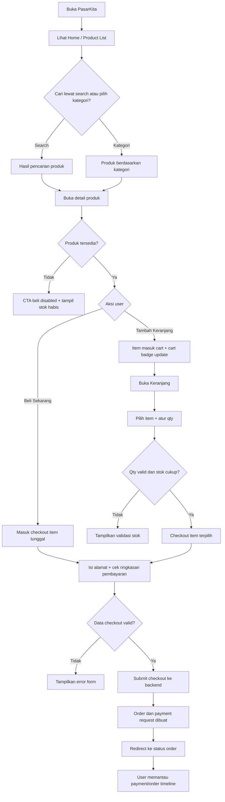
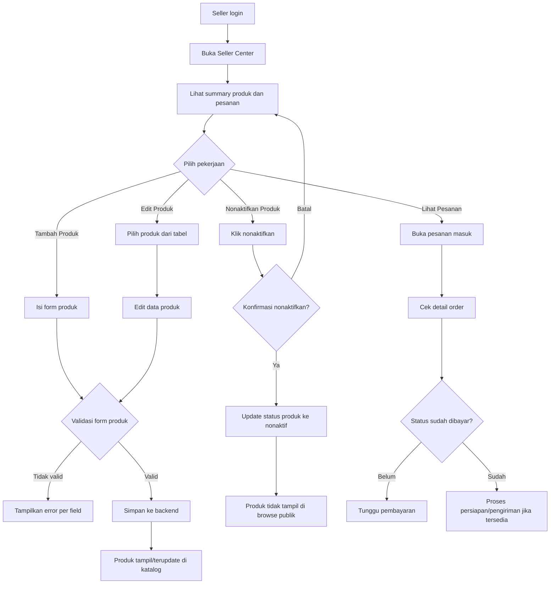
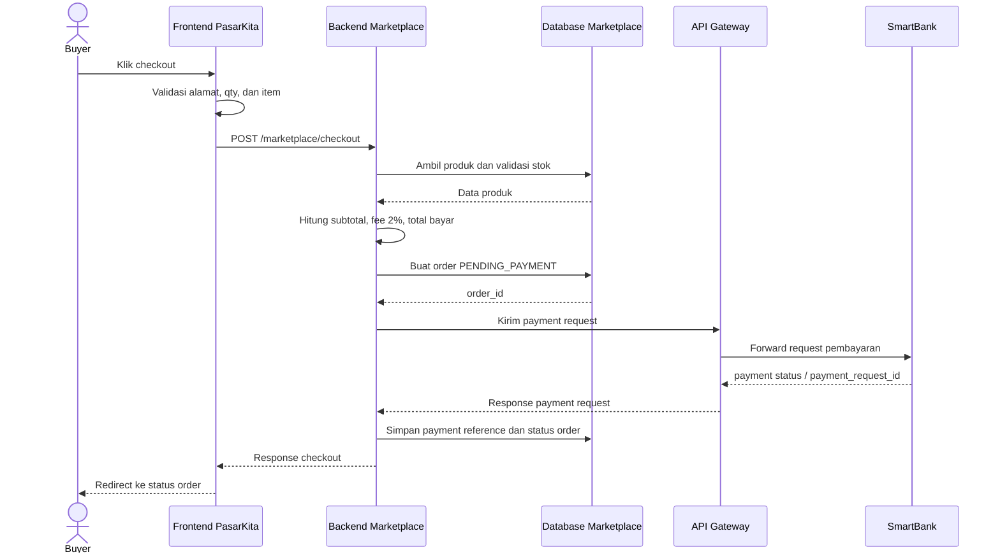
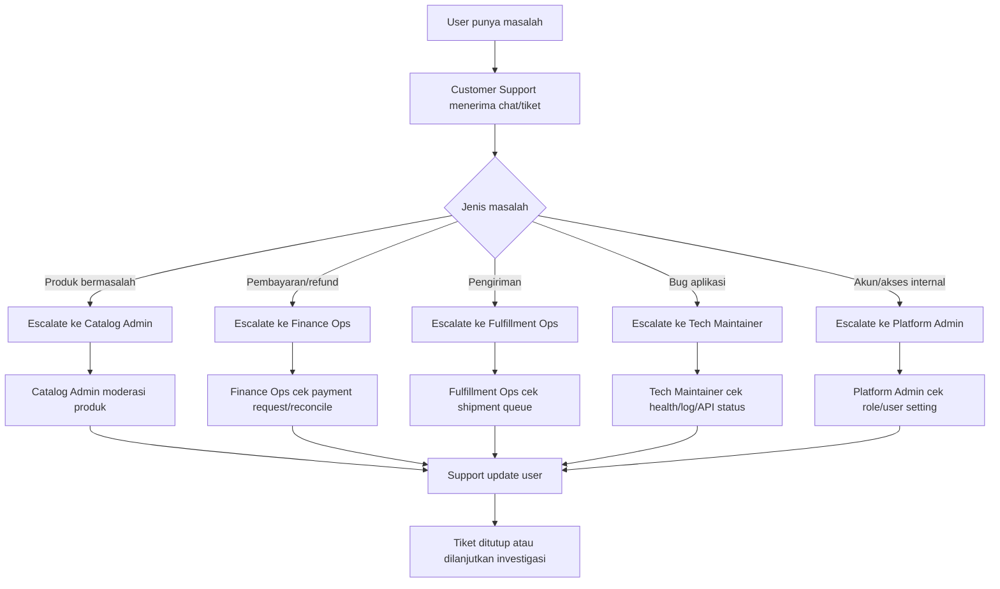
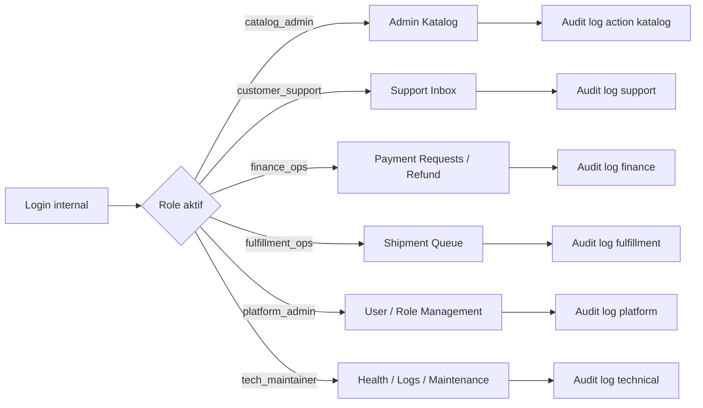

# PRD UI/UX Marketplace PasarKita

## 1. Ringkasan

### Nama Produk
Marketplace PasarKita

### Tujuan Dokumen
Dokumen ini menjadi arahan produk untuk merancang ulang UI/UX Marketplace PasarKita agar pengalaman belanja dan seller flow terasa seperti marketplace besar Indonesia, terutama pola umum Tokopedia: discovery lewat search dan kategori, product card padat, detail produk informatif, keranjang, checkout, pilihan pembayaran, status pesanan, dan seller center.

Nama aplikasi tetap `PasarKita`. Color palette yang sudah ada tidak diganti nama, tidak diganti token, dan tidak diubah arah dasarnya. Fokus perubahan ada pada struktur layar, alur pengguna, hirarki informasi, komponen, dan kualitas interaksi.

### Prinsip Utama
- PasarKita bukan landing page, tetapi aplikasi marketplace yang langsung bisa dipakai.
- Pengalaman utama harus cepat: cari produk, bandingkan, tambah keranjang, checkout, bayar, pantau pesanan.
- UI mengikuti pola e-commerce yang familiar, tetapi tidak menyalin identitas, logo, copywriting, aset, atau warna Tokopedia.
- Warna tetap memakai palette PasarKita existing: `slate`, `white`, `blue`, `green`, `amber`, `red`.
- Backend tetap menjadi sumber data produk, order, checkout, dan status.

## 2. Referensi dan Batasan

### Referensi Flow Marketplace
Flow belanja mengikuti pola umum marketplace:
1. User mencari produk lewat search bar atau kategori.
2. User membuka detail produk.
3. User memilih variasi/qty jika tersedia.
4. User menambahkan produk ke keranjang atau langsung checkout.
5. User memeriksa ringkasan transaksi di halaman checkout.
6. User memilih metode pembayaran.
7. Sistem membuat order/payment request.
8. User melihat status pembayaran dan pengiriman.

Panduan pembayaran publik untuk Tokopedia dari Maybank menunjukkan pola checkout: dari keranjang, cek transaksi, pilih pembayaran, pilih metode, lalu bayar. Pola ini dipakai sebagai inspirasi flow, bukan sebagai salinan tampilan.

### Referensi Teknis Context7
Frontend memakai Vite. Berdasarkan dokumentasi Vite di Context7:
- Variabel environment yang boleh dibaca client harus memakai prefix `VITE_`.
- `VITE_API_BASE_URL` tetap menjadi konfigurasi base URL backend.
- Production build memakai `vite build`.
- Preview build lokal memakai `vite preview`, bukan server production final.

### Batasan
- Tidak mengubah nama aplikasi.
- Tidak mengubah nama token color palette.
- Tidak mengganti identitas visual PasarKita menjadi Tokopedia.
- Tidak menambahkan flow non-marketplace seperti POS, SupplierHub, atau SmartBank dashboard.
- Tidak membuat marketplace memproses saldo langsung.

## 3. Target Pengguna

### Pembeli
User yang ingin menemukan produk UMKM, membandingkan harga, melihat reputasi seller, checkout, dan memantau pesanan.

### Seller
UMKM yang ingin mengelola produk, stok, harga, status aktif/nonaktif, dan melihat pesanan masuk.

### Admin Marketplace
Pengelola marketplace yang memantau katalog, kualitas listing, status order, dan kesehatan transaksi.

## 3A. Role Mapping dan Hak Akses

Marketplace PasarKita tidak boleh menganggap semua pekerjaan internal dilakukan oleh satu role `admin`. Sistem harus memisahkan role berdasarkan pekerjaan operasional agar UI, menu, dan permission lebih jelas.

### 3A.1 Daftar Role

| Role | Tujuan Role | Area Utama |
| --- | --- | --- |
| `buyer` | Membeli produk dan memantau pesanan pribadi | Marketplace, cart, checkout, order status |
| `seller` | Mengelola toko dan produk sendiri | Seller Center |
| `catalog_admin` | Moderasi katalog dan kualitas listing | Admin Katalog |
| `customer_support` | Membantu user terkait pesanan, komplain, dan chat | Support Center |
| `finance_ops` | Memantau payment request, fee, refund, dan rekonsiliasi | Finance Ops |
| `fulfillment_ops` | Memantau order yang siap dikirim dan koordinasi logistik | Fulfillment Ops |
| `platform_admin` | Mengelola user internal, konfigurasi sistem, dan audit | Admin Platform |
| `tech_maintainer` | Maintenance aplikasi, monitoring error, health check, dan deployment | Technical Console |

### 3A.2 Role Pembeli

Nama role: `buyer`

Deskripsi tugas:
Pembeli adalah user utama marketplace yang memakai PasarKita untuk mencari dan membeli produk. Fokus role ini adalah discovery produk, keranjang, checkout, dan memantau pesanan sendiri.

Navigasi:
- Home / Produk
- Detail Produk
- Keranjang
- Checkout
- Pesanan Saya
- Profil dan alamat
- Chat dengan seller/support jika fitur chat tersedia

Hak akses:
- Melihat produk aktif.
- Menambahkan produk ke keranjang.
- Membuat checkout.
- Melihat order milik sendiri.
- Mengirim chat/komplain terkait order sendiri.

Batasan:
- Tidak bisa mengelola produk.
- Tidak bisa melihat order user lain.
- Tidak bisa mengubah status pembayaran.

### 3A.3 Role Seller

Nama role: `seller`

Deskripsi tugas:
Seller adalah pemilik toko atau UMKM yang menjual produk di PasarKita. Fokus role ini adalah mengelola toko sendiri, menjaga stok dan harga tetap benar, memproses pesanan yang masuk, dan membalas chat pembeli terkait produk/toko miliknya.

Navigasi:
- Seller Dashboard
- Produk Saya
- Tambah/Edit Produk
- Pesanan Masuk
- Chat Pembeli
- Profil Toko

Hak akses:
- Membuat dan mengedit produk milik sendiri.
- Menonaktifkan produk milik sendiri.
- Melihat pesanan yang berisi produk miliknya.
- Membalas chat pembeli terkait toko/order miliknya.
- Mengubah status fulfillment jika proses pengiriman dikelola seller.

Batasan:
- Tidak bisa mengedit produk seller lain.
- Tidak bisa melihat payment detail sensitif user.
- Tidak bisa mengubah status pembayaran.
- Tidak bisa mengakses konfigurasi sistem.

### 3A.4 Role Catalog Admin

Nama role: `catalog_admin`

Deskripsi tugas:
Catalog admin adalah admin yang menjaga kualitas katalog marketplace. Fokus role ini adalah memastikan produk yang tampil layak, kategorinya benar, tidak melanggar aturan, dan tidak menyesatkan pembeli. Role ini bukan admin pembayaran dan bukan teknisi aplikasi.

Navigasi:
- Admin Katalog
- Semua Produk
- Moderasi Produk
- Kategori
- Laporan Produk Bermasalah

Hak akses:
- Melihat semua produk.
- Menonaktifkan produk yang melanggar aturan.
- Mengubah kategori atau metadata katalog jika diperlukan.
- Menandai produk perlu revisi.
- Melihat riwayat perubahan produk.

Batasan:
- Tidak bisa mengubah saldo/payment.
- Tidak bisa mengakses deployment/maintenance.
- Tidak boleh mengubah data toko tanpa alasan moderasi.

### 3A.5 Role Customer Support

Nama role: `customer_support`

Deskripsi tugas:
Customer support adalah tim bantuan pelanggan. Fokus role ini adalah membalas chat user, membantu pembeli atau seller memahami masalah pesanan, membuat catatan tiket, dan mengeskalasi masalah ke tim yang tepat. Misalnya masalah pembayaran dikirim ke finance ops, kendala pengiriman ke fulfillment ops, dan produk bermasalah ke catalog admin.

Navigasi:
- Support Inbox
- Chat User
- Detail Tiket/Komplain
- Lookup Order
- Riwayat Percakapan

Hak akses:
- Melihat order untuk kebutuhan bantuan.
- Membalas chat user.
- Membuat catatan internal pada tiket.
- Mengeskalasi kasus ke finance ops, fulfillment ops, atau catalog admin.
- Mengubah status tiket support.

Batasan:
- Tidak bisa membuat refund langsung.
- Tidak bisa mengubah status pembayaran.
- Tidak bisa mengedit produk.
- Tidak bisa mengakses source code atau deployment.

### 3A.6 Role Finance Ops

Nama role: `finance_ops`

Deskripsi tugas:
Finance ops adalah tim operasional pembayaran. Fokus role ini adalah memantau payment request, fee marketplace, transaksi gagal, rekonsiliasi, dan refund jika fitur refund tersedia. Role ini tidak mengubah saldo langsung di Marketplace karena saldo tetap menjadi tanggung jawab SmartBank/API Gateway.

Navigasi:
- Payment Requests
- Fee Marketplace
- Rekonsiliasi
- Refund Review
- Payment Error Queue

Hak akses:
- Melihat payment request.
- Melihat fee marketplace.
- Melihat status transaksi dari SmartBank/API Gateway.
- Menandai transaksi perlu investigasi.
- Menyetujui atau menolak refund jika flow refund tersedia.

Batasan:
- Tidak bisa mengubah saldo secara langsung di Marketplace.
- Tidak bisa mengedit produk.
- Tidak bisa melakukan deployment.
- Semua tindakan finansial tetap harus lewat SmartBank/API Gateway.

### 3A.7 Role Fulfillment Ops

Nama role: `fulfillment_ops`

Deskripsi tugas:
Fulfillment ops adalah tim operasional pengiriman. Fokus role ini adalah memantau order yang sudah dibayar, mengatur shipment queue, menangani kendala pengiriman, dan memastikan status pengiriman bergerak dari siap dikirim sampai selesai.

Navigasi:
- Order Siap Kirim
- Shipment Queue
- Detail Pengiriman
- Kendala Pengiriman

Hak akses:
- Melihat order dengan status `PAID` atau `READY_FOR_SHIPMENT`.
- Memantau pengiriman.
- Mengeskalasi kendala logistik.
- Update status operasional pengiriman jika endpoint tersedia.

Batasan:
- Tidak bisa melihat payment credential.
- Tidak bisa mengubah produk.
- Tidak bisa mengubah status pembayaran.

### 3A.8 Role Platform Admin

Nama role: `platform_admin`

Deskripsi tugas:
Platform admin adalah pengelola akses internal dan konfigurasi platform. Fokus role ini adalah mengatur user internal, role, permission, konfigurasi marketplace non-finansial, dan audit log. Role ini memastikan pembagian akses antar tim tetap rapi dan tidak semua orang menjadi superadmin.

Navigasi:
- User Management
- Role Management
- System Settings
- Audit Log
- Admin Activity

Hak akses:
- Mengelola user internal.
- Mengatur role dan permission.
- Melihat audit log.
- Mengatur konfigurasi marketplace non-finansial.
- Menonaktifkan akun internal jika diperlukan.

Batasan:
- Tidak menggantikan tugas finance ops untuk transaksi.
- Tidak menggantikan tech maintainer untuk deployment.
- Semua perubahan role harus masuk audit log.

### 3A.9 Role Tech Maintainer

Nama role: `tech_maintainer`

Deskripsi tugas:
Tech maintainer adalah teknisi yang menjaga aplikasi tetap berjalan. Fokus role ini adalah health check, error log, API status, deployment info, maintenance mode, dan debugging teknis. Role ini tidak mengurus produk, chat user, order, atau payment secara manual kecuali ada prosedur debugging resmi.

Navigasi:
- Health Check
- Error Logs
- API Status
- Deployment Info
- Maintenance Mode
- Environment Config Readonly

Hak akses:
- Melihat status service frontend/backend.
- Melihat error log teknis.
- Menjalankan maintenance aplikasi sesuai SOP.
- Mengaktifkan maintenance mode jika fitur tersedia.
- Melihat konfigurasi teknis non-secret.

Batasan:
- Tidak mengakses chat user kecuali untuk debugging dengan izin.
- Tidak mengubah order/payment secara manual.
- Tidak mengelola produk/katalog.
- Tidak boleh melihat secret mentah di UI.

### 3A.10 Matrix Akses Fitur

| Fitur | buyer | seller | catalog_admin | customer_support | finance_ops | fulfillment_ops | platform_admin | tech_maintainer |
| --- | --- | --- | --- | --- | --- | --- | --- | --- |
| Browse produk | Yes | Yes | Yes | Yes | Read | Read | Read | Read |
| Detail produk | Yes | Yes | Yes | Yes | Read | Read | Read | Read |
| Keranjang | Own | No | No | No | No | No | No | No |
| Checkout | Own | No | No | Assist only | Read | No | No | No |
| Pesanan user | Own | Seller-related | Read | Support scope | Payment scope | Fulfillment scope | Read | No |
| Kelola produk | No | Own products | All/moderation | No | No | No | No | No |
| Chat user | Own chat | Store chat | No | All support chat | No | Related shipment only | Audit only | No |
| Payment request | Own summary | Order summary | No | Read limited | Full ops | Read limited | Audit only | No |
| Refund/reconcile | No | No | No | Escalate | Yes | No | Audit only | No |
| Shipment status | Own order | Seller order | No | Read/escalate | No | Yes | Audit only | No |
| User/role management | No | No | No | No | No | No | Yes | No |
| Audit log | No | Own activity | Catalog scope | Support scope | Finance scope | Fulfillment scope | Full | Technical scope |
| Health/deployment | No | No | No | No | No | No | Read | Full technical |

Keterangan:
- `Own` berarti hanya data milik user tersebut.
- `Read` berarti hanya baca, tidak bisa melakukan aksi perubahan.
- `Assist only` berarti hanya membantu user melalui support, bukan melakukan checkout atas nama user tanpa mekanisme resmi.
- `Audit only` berarti hanya melihat jejak audit yang relevan, bukan mengubah data.

### 3A.11 Implikasi UI Berdasarkan Role

App shell harus menampilkan menu sesuai role:
- `buyer`: Produk, Keranjang, Pesanan, Chat, Profil.
- `seller`: Seller Center, Produk Saya, Pesanan Masuk, Chat Pembeli.
- `catalog_admin`: Admin Katalog, Produk Bermasalah, Kategori.
- `customer_support`: Support Inbox, Lookup Order, Chat.
- `finance_ops`: Payment Requests, Fee, Refund, Reconcile.
- `fulfillment_ops`: Shipment Queue, Kendala Kirim.
- `platform_admin`: Users, Roles, Settings, Audit Log.
- `tech_maintainer`: Health, Logs, API Status, Maintenance.

Jika satu akun memiliki lebih dari satu role, UI boleh menyediakan role switcher. Role switcher tidak boleh mencampur semua menu menjadi satu sidebar panjang; menu harus tetap dikelompokkan berdasarkan konteks kerja.

### 3A.12 Audit dan Keamanan Role

Semua role internal wajib masuk audit log saat melakukan aksi penting:
- menonaktifkan produk,
- mengubah status order,
- membuka detail payment,
- menyetujui refund,
- mengubah role user,
- mengaktifkan maintenance mode.

Data sensitif harus dibatasi:
- buyer hanya melihat order sendiri,
- seller hanya melihat data order yang relevan dengan toko,
- customer support hanya melihat data yang dibutuhkan untuk tiket,
- tech maintainer tidak melihat secret mentah,
- finance ops tidak mengubah saldo langsung di Marketplace.

## 4. Sasaran UX

### Discovery Cepat
User harus langsung melihat search bar utama, kategori, dan produk rekomendasi tanpa perlu membaca penjelasan panjang.

### Familiar E-commerce Flow
Alur utama harus terasa familiar:
`Home -> Search/Kategori -> Product Detail -> Cart -> Checkout -> Payment -> Order Status`

### Informasi Produk Padat
Product card harus menampilkan informasi yang cukup untuk keputusan cepat:
- nama produk,
- harga,
- kategori,
- seller,
- lokasi seller jika tersedia,
- stok/status,
- tombol detail,
- tombol tambah keranjang atau beli.

### Checkout Terpercaya
Checkout harus menampilkan ringkasan biaya secara jelas:
- subtotal,
- biaya layanan marketplace 2%,
- total bayar,
- alamat pengiriman,
- metode pembayaran,
- status payment request.

### Seller Center Efisien
Seller dashboard harus terasa seperti tool operasional, bukan halaman promosi. Tabel dan form harus rapi, padat, dan cepat dipakai.

## 5. Information Architecture

### Navigasi Utama
- Logo PasarKita.
- Search bar besar.
- Kategori.
- Keranjang.
- Pesanan.
- Seller Center.
- Akun.

### Route Utama
| Route | Halaman | Fungsi |
| --- | --- | --- |
| `#/` atau `#/products` | Marketplace Home / Product List | Discovery produk |
| `#/products/:id` | Product Detail | Detail produk dan CTA beli |
| `#/cart` | Keranjang | Review produk sebelum checkout |
| `#/checkout` | Checkout | Alamat, ringkasan biaya, metode pembayaran |
| `#/orders/:id` | Order Status | Status pembayaran dan pesanan |
| `#/seller/products` | Seller Center | Manajemen produk |
| `#/seller/orders` | Seller Orders | Pesanan masuk seller |

## 6. Flow Pembeli

### 6.0 Diagram Flow Pembeli

### 6.1 Home / Product Discovery
Halaman pertama harus langsung menampilkan marketplace experience.

Komponen:
- topbar sticky,
- search bar dominan,
- shortcut kategori horizontal,
- banner promo ringan,
- section rekomendasi produk,
- section produk terbaru,
- section produk UMKM pilihan,
- floating/cart counter jika user menambahkan produk.

Behavior:
- Search mengarah ke daftar produk dengan query.
- Kategori memfilter produk.
- Product card bisa membuka detail atau tambah keranjang.
- Jika backend gagal, tampil error state dengan tombol retry.

Acceptance criteria:
- User melihat produk tanpa scroll panjang.
- Search selalu mudah ditemukan.
- Tidak ada hero marketing besar yang menutupi katalog.
- Produk dari backend tampil dalam grid responsif.

### 6.2 Search dan Filter
Search harus menjadi pola utama seperti marketplace.

Fitur:
- keyword search,
- filter kategori,
- filter harga minimum/maksimum,
- filter stok tersedia,
- sort relevansi, termurah, termahal, terbaru,
- result count,
- clear filter.

UX detail:
- Search bar tetap di topbar.
- Setelah search, query tetap terlihat.
- Empty state memberi saran ubah keyword/filter.
- Filter mobile tampil sebagai bottom sheet atau panel collapsible.

### 6.3 Product Card
Product card harus compact dan scan-friendly.

Konten minimum:
- area image/placeholder produk,
- badge kategori,
- nama produk maksimal 2 baris,
- harga tebal,
- seller/lokasi,
- stok atau status habis,
- rating/reputasi jika nanti tersedia,
- CTA `Detail`,
- CTA `+ Keranjang` atau `Beli`.

Aturan:
- Card tidak boleh terlalu tinggi.
- Tombol tidak boleh membuat card bergeser saat hover.
- Produk stok 0 tetap boleh terlihat jika hasil search relevan, tetapi CTA beli disabled dan label `Stok Habis`.

### 6.4 Product Detail Page
Halaman detail meniru pola marketplace: media di kiri, informasi dan CTA di kanan, detail tambahan di bawah.

Komponen:
- breadcrumb,
- media produk,
- nama produk,
- harga,
- stok,
- kategori,
- info seller,
- quantity stepper,
- tombol `Tambah ke Keranjang`,
- tombol `Beli Sekarang`,
- deskripsi produk,
- info biaya layanan,
- rekomendasi produk serupa.

Behavior:
- Qty tidak boleh lebih dari stok.
- Jika klik `Beli Sekarang`, user masuk checkout dengan item tersebut.
- Jika klik `Tambah ke Keranjang`, cart counter naik dan toast muncul.
- Jika produk nonaktif, CTA disabled.

### 6.5 Cart
Keranjang wajib ada supaya flow lebih mirip marketplace.

Komponen:
- daftar item per seller,
- checkbox pilih semua,
- checkbox per item,
- qty stepper,
- hapus item,
- subtotal per item,
- ringkasan belanja sticky di kanan pada desktop,
- CTA `Checkout`.

Behavior:
- User dapat checkout hanya item terpilih.
- Qty update harus valid terhadap stok.
- Item stok habis diberi warning dan tidak bisa dipilih.
- Ringkasan biaya update realtime.

### 6.6 Checkout
Checkout harus menjadi halaman review final.

Komponen:
- alamat pengiriman,
- daftar item,
- catatan untuk seller jika diperlukan,
- metode pembayaran,
- ringkasan pembayaran,
- subtotal,
- marketplace fee 2%,
- total bayar,
- CTA `Buat Pesanan`.

Behavior:
- User wajib mengisi alamat pengiriman.
- Sistem menampilkan breakdown biaya sebelum submit.
- Setelah submit sukses, redirect ke order status.
- Jika checkout gagal, tampil error inline dan toast.

Catatan:
Marketplace PasarKita tetap hanya membuat order dan payment request. Saldo dan transaksi finansial tetap tanggung jawab SmartBank/API Gateway.

### 6.7 Payment Request
Karena scope backend saat ini membuat payment request, UI harus menampilkan status pembayaran dengan jelas.

Status:
- `PENDING_PAYMENT`: menunggu pembayaran,
- `PAYMENT_PROCESSING`: pembayaran diproses,
- `PAID`: pembayaran berhasil,
- `PAYMENT_FAILED`: pembayaran gagal.

UI:
- tampilkan order id,
- tampilkan payment request id jika ada,
- tampilkan total bayar,
- tombol refresh status,
- tombol kembali belanja.

### 6.8 Order Status
Halaman status pesanan harus memakai timeline.

Timeline minimum:
1. Pesanan dibuat.
2. Menunggu pembayaran.
3. Pembayaran berhasil/gagal.
4. Siap dikirim.
5. Dikirim.
6. Selesai.

Behavior:
- Status aktif diberi highlight.
- Status gagal memakai pesan yang actionable.
- User bisa refresh status.
- User bisa kembali ke katalog.

## 7. Flow Seller

### 7.0 Diagram Flow Seller

### 7.1 Seller Center Dashboard
Seller center harus padat dan operasional.

Komponen:
- summary cards: total produk, aktif, nonaktif, stok habis,
- search produk,
- filter status,
- tabel produk,
- tombol tambah produk,
- quick action edit/nonaktifkan.

### 7.2 Product Management
Form produk harus mudah diisi.

Field:
- seller id,
- nama produk,
- kategori,
- harga,
- stok,
- deskripsi,
- status aktif,
- image placeholder atau upload jika nanti tersedia.

UX:
- Form tambah/edit dapat berupa page split atau modal.
- Preview produk tampil saat mengisi form.
- Validasi muncul dekat field.
- Setelah berhasil simpan, tabel refresh.

### 7.3 Seller Order Management
Jika backend tersedia, seller harus dapat melihat order masuk.

Komponen:
- tabel order,
- order id,
- nama pembeli,
- produk,
- qty,
- total,
- status pembayaran,
- status pengiriman,
- aksi proses pesanan.

## 8. UI Layout Requirement

### Desktop
- Topbar sticky.
- Search bar di tengah dan lebar.
- Product grid 4 kolom jika layar cukup.
- Checkout memakai layout 2 kolom: form kiri, summary kanan sticky.
- Seller center memakai sidebar atau top tabs dengan tabel lebar.

### Mobile
- Topbar lebih ringkas.
- Search tetap mudah diakses.
- Kategori horizontal scroll.
- Product grid 2 kolom.
- Cart summary sticky di bawah.
- Filter sebagai bottom sheet/collapsible.
- Tabel seller berubah menjadi card list jika perlu.

## 9. Komponen UI Wajib

### App Shell
- topbar,
- mobile nav,
- search bar,
- cart badge,
- account menu.

### Product Components
- product card,
- product media placeholder,
- product badge,
- price display,
- stock label,
- seller mini profile.

### Commerce Components
- qty stepper,
- cart item row,
- checkout summary,
- fee breakdown,
- payment method selector,
- order timeline.

### Seller Components
- seller stat card,
- product table,
- product form,
- status badge,
- confirmation dialog.

### Feedback Components
- loading skeleton,
- empty state,
- error state,
- toast,
- disabled state,
- inline validation.

## 10. Color Palette Requirement

Color palette tidak diubah. Token yang sudah ada tetap dipakai:
- `--white`
- `--slate-50` sampai `--slate-900`
- `--blue-50` sampai `--blue-700`
- `--green-100`, `--green-700`
- `--red-50`, `--red-100`, `--red-500`, `--red-700`
- `--amber-50`, `--amber-100`, `--amber-600`, `--amber-700`

Aturan pemakaian:
- `blue-600` tetap untuk CTA utama dan state aktif.
- `slate` dan `white` tetap dominan untuk layout marketplace.
- `green` hanya untuk sukses/aktif/paid.
- `amber` hanya untuk warning/fee/menunggu.
- `red` hanya untuk error/gagal/destructive action.
- Jangan memakai hijau Tokopedia sebagai warna brand utama karena palette PasarKita tidak boleh diubah.

## 11. Typography dan Visual Hierarchy

Aturan:
- Harga harus lebih menonjol dari deskripsi.
- Nama produk maksimal 2 baris pada card.
- Deskripsi panjang hanya tampil di detail page.
- CTA utama harus selalu paling jelas.
- Text helper harus kecil tetapi tetap terbaca.
- Jangan memakai heading hero besar untuk area dashboard atau tabel.

## 12. Interaction Detail

### Search
- Enter menjalankan search.
- Tombol search terlihat jelas.
- Query tersimpan di URL.

### Add to Cart
- Klik `+ Keranjang` menambah item.
- Toast sukses muncul.
- Cart badge update.
- Jika item sudah ada, qty bertambah.

### Quantity
- Stepper plus/minus.
- Input angka tetap bisa diketik.
- Validasi stok realtime.

### Checkout
- Tombol submit disabled saat form tidak valid atau sedang loading.
- Setelah sukses, redirect ke status order.
- Jika gagal, tidak menghapus cart.

### Seller Actions
- Nonaktifkan produk wajib confirmation.
- Edit produk mempertahankan data lama.
- Save menampilkan loading state.

## 13. Data dan API

Frontend tetap menggunakan API backend yang sudah ada.

Endpoint minimum:
- `GET /marketplace/browse_produk`
- `GET /marketplace/products/:id`
- `GET /marketplace/seller/products`
- `POST /marketplace/manajemen_produk`
- `PATCH /marketplace/products/:id/status`
- `POST /marketplace/checkout`
- `GET /marketplace/status_order`
- `GET /marketplace/biaya_layanan_marketplace`

Tambahan yang direkomendasikan untuk flow marketplace:
- `GET /marketplace/cart`
- `POST /marketplace/cart/items`
- `PATCH /marketplace/cart/items/:id`
- `DELETE /marketplace/cart/items/:id`
- `GET /marketplace/orders`
- `GET /marketplace/seller/orders`

Jika cart backend belum tersedia, cart dapat sementara disimpan di `localStorage`, tetapi checkout final tetap wajib hit backend.

## 13A. Diagram Flow Sistem

### 13A.1 Checkout dan Payment Request

### 13A.2 Role Escalation Flow

### 13A.3 Admin Area Routing Berdasarkan Role

## 14. Acceptance Criteria

### Product Discovery
- User dapat mencari produk dari topbar.
- User dapat filter kategori dan sort harga.
- Product card tampil dalam grid rapi.
- Produk backend tampil tanpa dummy hardcoded.

### Product Detail
- User dapat melihat detail produk lengkap.
- User dapat mengatur qty.
- CTA disabled saat stok habis/nonaktif.
- User dapat tambah ke cart atau beli langsung.

### Cart
- User dapat memilih item.
- User dapat mengubah qty.
- User dapat menghapus item.
- Summary berubah realtime.

### Checkout
- User dapat melihat alamat, item, subtotal, fee, total.
- User tidak bisa submit tanpa alamat.
- Submit membuat order/payment request.
- Sukses redirect ke order status.

### Order Status
- Timeline status tampil jelas.
- Status gagal/sukses mudah dibedakan.
- Tombol refresh tersedia.

### Seller Center
- Seller dapat melihat daftar produk.
- Seller dapat tambah/edit/nonaktifkan produk.
- Form memiliki validasi.
- Tabel tetap rapi di desktop dan usable di mobile.

## 15. Prioritas Implementasi

### Must Have
- Redesign topbar dengan search dan cart.
- Product list dengan grid marketplace.
- Product detail dengan CTA beli.
- Cart page.
- Checkout page dengan fee breakdown.
- Order status timeline.
- Seller product management rapi.

### Should Have
- Filter bottom sheet mobile.
- Product recommendation section.
- Seller mini profile.
- Toast dan skeleton loading.
- Sticky checkout summary.

### Could Have
- Wishlist.
- Voucher/promo placeholder.
- Rating dan ulasan.
- Chat seller placeholder.
- Multiple payment method UI.

## 16. Milestone

### Phase 1: App Shell dan Product Discovery
- Topbar sticky.
- Search bar utama.
- Kategori horizontal.
- Product grid.
- Product card baru.

### Phase 2: Buyer Commerce Flow
- Product detail.
- Cart.
- Checkout.
- Order status timeline.

### Phase 3: Seller Center
- Dashboard summary.
- Product table.
- Product form.
- Product action state.

### Phase 4: Polish
- Responsive mobile.
- Skeleton loading.
- Empty/error states.
- Accessibility pass.
- UX copy refinement.

## 17. Risiko

| Risiko | Dampak | Mitigasi |
| --- | --- | --- |
| UI terlalu mirip brand Tokopedia | Risiko identitas dan orisinalitas | Ambil pola flow saja, bukan warna/logo/copy/aset |
| Palette diganti tanpa sadar | Konsistensi rusak | Gunakan token PasarKita existing |
| Cart hanya localStorage | Data tidak sinkron antar device | Jadikan localStorage sebagai fase sementara |
| Checkout gagal tetapi cart hilang | UX buruk | Jangan clear cart sampai order sukses |
| Seller table buruk di mobile | Sulit dipakai | Ubah tabel menjadi card list di mobile |

## 18. Referensi

- Vite documentation via Context7: env variables client-side memakai prefix `VITE_`, build memakai `vite build`, preview memakai `vite preview`.
- Maybank guide for Tokopedia payment flow: https://www.maybank.co.id/ebanking/how-to/bill-payment/pembayaran-tokopedia
- Color palette existing: `frontend/docs/COLOR_PALETTE_REPORT.md`

## 19. Kesimpulan

PasarKita perlu diarahkan menjadi marketplace experience yang langsung terasa familiar: search-first, katalog padat, product detail informatif, cart, checkout, payment request, dan order tracking. Flow boleh terinspirasi dari Tokopedia karena pengguna Indonesia sudah terbiasa dengan pola tersebut, tetapi identitas PasarKita tetap dipertahankan melalui nama, color palette, dan batasan sistem yang sudah ada.
