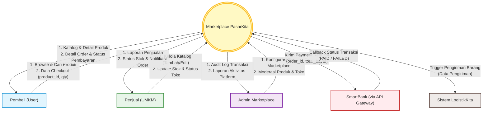

# Spesifikasi Ringkas: Marketplace PasarKita

Dokumen ini berisi spesifikasi ringkas untuk **Marketplace PasarKita** sebagai pemenuhan Tugas Praktek Mandiri. 

---

## 1. Deskripsi Fungsional (Ruang Lingkup)

**Marketplace PasarKita** adalah sebuah platform B2C (Business-to-Consumer) berbasis web/mobile yang dirancang khusus untuk memfasilitasi transaksi jual beli produk Usaha Mikro, Kecil, dan Menengah (UMKM). Sistem ini berfungsi sebagai wadah bagi Penjual (UMKM) untuk mempublikasikan dan mengelola katalog produk mereka, serta memberikan kemudahan bagi Pembeli untuk melakukan pencarian, penelusuran, hingga proses pemesanan (*checkout*) produk secara online. Di dalam ekosistem sistem yang lebih luas, PasarKita bertindak sebagai penghasil permintaan (*demand generator*), di mana setiap transaksi dikenakan biaya layanan (*marketplace fee*) sebesar 2% yang dihitung secara otomatis, sedangkan pengelolaan saldo pengguna dan verifikasi transaksi keuangan sepenuhnya didelegasikan secara aman ke sistem perbankan eksternal (**SmartBank**) melalui **API Gateway**.

---

## 2. Visualisasi Desain: Diagram Konteks (DFD Level 0)

Berikut adalah Diagram Konteks (Data Flow Diagram Level 0) yang menggambarkan batasan sistem Marketplace PasarKita, entitas luar yang berinteraksi, serta aliran data masuk dan keluar dari sistem.

---

## 3. Pengujian: Test Case Fitur Utama (Checkout Produk)

Berikut adalah skenario pengujian (*test case*) untuk fitur utama **Checkout dan Pembuatan Pesanan**.

| Parameter Pengujian | Detail Skenario |
| :--- | :--- |
| **ID & Nama Test Case** | TC-001: Pembuatan Pesanan (*Checkout*) dengan Stok Produk Cukup |
| **Fitur Utama** | Checkout dan Integrasi Pembayaran |
| **Deskripsi** | Memverifikasi alur checkout dari pemilihan produk oleh pembeli hingga sistem berhasil membuat order dengan status `PENDING_PAYMENT` dan mengirimkan request pembayaran ke SmartBank. |
| **Pre-kondisi** | 1. Pembeli memiliki akun aktif (`user_id`: "USR001") dengan saldo cukup di SmartBank. 2. Produk "Kopi Arabika" (`product_id`: "PRD001") dalam status aktif dengan stok tersedia 10 pcs dan harga Rp25.000 per unit. |
| **Data Input** | - `user_id`: "USR001" - `product_id`: "PRD001" - `qty`: 2 - `alamat_pengiriman`: "Jl. Merdeka No. 45, Salatiga" |

### Langkah-Langkah Pengujian

1. Login ke aplikasi sebagai pembeli (`user_id`: "USR001").
2. Cari dan masuk ke halaman detail produk "Kopi Arabika" (`product_id`: "PRD001").
3. Masukkan jumlah pembelian (`qty`) sebanyak **2** pada kolom kuantitas.
4. Klik tombol **"Beli Sekarang"** untuk masuk ke halaman Checkout.
5. Masukkan alamat pengiriman: **"Jl. Merdeka No. 45, Salatiga"**.
6. Klik tombol **"Buat Pesanan"** (menjalankan proses POST `/marketplace/checkout`).

### Hasil yang Diharapkan (*Expected Result*)

1. **Pengurangan Stok Sementara**: Stok produk "Kopi Arabika" berkurang sebanyak 2 pcs (stok di database ter-update dari 10 menjadi 8 pcs).
2. **Pembuatan Order**: Sistem berhasil membuat entri order baru dengan status awal `PENDING_PAYMENT` dan menghasilkan rincian biaya yang tepat:
   - Subtotal: **Rp50.000** (2 x Rp25.000)
   - Biaya Layanan Marketplace (2%): **Rp1.000** (2% dari Rp50.000)
   - Total Pembayaran: **Rp51.000** (Rp50.000 + Rp1.000)
3. **Pengiriman Payment Request**: Sistem berhasil mengirimkan data pembayaran ke SmartBank via API Gateway dan menerima respon sukses berisi `payment_request_id` (misalnya: "PAYREQ001").
4. **Respon JSON & Redireksi**: Sistem mengembalikan status sukses JSON berisi detail order lengkap dengan total pembayaran dan pengguna dialihkan ke halaman instruksi pembayaran.
