# Laporan Analisis dan Refactoring Kode Aplikasi Web

## 1. Identitas Proyek

| Item | Keterangan |
| --- | --- |
| Nama aplikasi | PasarKita Marketplace |
| Jenis aplikasi | Aplikasi marketplace web dengan backend API dan frontend single page application |
| Mata kuliah | [Isi nama mata kuliah] |
| Topik | Analisis dan Refactoring Kode Aplikasi Web |
| Pola arsitektur | Backend menggunakan pola berlapis yang mendekati MVC: route, controller, service, repository, model. Frontend menggunakan modular Vanilla JavaScript berbasis hash routing. |
| Teknologi/framework | Go, Fiber, GORM, MySQL, Swagger/OpenAPI, Vite, Vanilla JavaScript, Tailwind CSS, DaisyUI, GSAP, Zod, Toastify.js, Tabulator, Chart.js |
| Nama kelompok | [Isi nama kelompok] |
| Anggota kelompok | [Isi anggota kelompok] |
| Repository | Workspace lokal `D:\Kegabutan\Tubes RPL\Marketplace` |
| Sumber observasi kode | Folder `backend`, folder `frontend-new`, file tugas `D:\Downloads\1.soal_tugas_refactoring_P14.txt`, dan file contoh laporan `D:\Downloads\2.contoh_laporan_refactoring_portal_kuesioner_psikometrik.txt` |
| Tanggal analisis | 22 Juni 2026 |

## 2. Deskripsi Singkat Aplikasi

PasarKita Marketplace adalah aplikasi marketplace web yang terdiri dari backend API dan frontend SPA. Backend berada pada folder `backend` dan dibangun menggunakan Go Fiber sebagai HTTP framework, GORM sebagai ORM, serta MySQL sebagai database. Frontend berada pada folder `frontend-new` dan dibangun menggunakan Vite, Vanilla JavaScript, Tailwind CSS, DaisyUI, serta beberapa library UI seperti Chart.js, Tabulator, GSAP, Zod, Toastify.js, dan lucide.

Tujuan aplikasi adalah menyediakan alur marketplace: katalog produk, pencarian produk, detail produk, cart, checkout, payment dummy/integrasi payment, order status, akun pengguna, alamat, seller dashboard, voucher, review, diskusi produk, chat, dan notifikasi. Pengguna utama yang terlihat dari kode adalah buyer, seller, admin katalog, customer support, finance ops, fulfillment ops, platform admin, dan tech maintainer. Role tersebut didefinisikan pada `backend/models/models.go`.

Berdasarkan `backend/main.go`, aplikasi backend berjalan dengan memuat konfigurasi environment, membuka koneksi database, menjalankan auto migration, menjalankan seed database, membuat instance repository, service, controller, lalu mendaftarkan route melalui `routes.Register`. Berdasarkan `frontend-new/package.json`, frontend dijalankan dengan `npm run dev` dan dibangun untuk produksi dengan `npm run build`.

Batasan analisis: laporan ini tidak mengubah source code utama aplikasi. Kode sesudah refactoring pada bagian before-after adalah rancangan edukatif yang realistis berdasarkan stack aktual repository. Pengujian yang dilakukan adalah `go test ./...` pada backend dan `npm run build` pada frontend. Pengujian end-to-end terhadap database atau endpoint live tidak dilakukan karena laporan ini fokus pada analisis kode dan tidak menjalankan service database secara eksplisit.

## 3. Tujuan Refactoring

Refactoring pada repository ini bertujuan untuk meningkatkan maintainability, readability, testability, cohesion, dan menurunkan coupling antar lapisan. Kode sudah memiliki pemisahan folder yang cukup baik, tetapi beberapa method masih memiliki banyak tanggung jawab sekaligus, terutama pada service checkout, penyimpanan produk, registrasi route, dan service cart.

Tujuan teknis refactoring yang disarankan adalah:

- Memisahkan parsing HTTP, validasi input, business logic, dan akses data.
- Mengurangi method yang terlalu panjang dan sulit diuji secara unit.
- Memusatkan magic value seperti status payment, courier default, service default, dan akun tujuan payment.
- Memindahkan logika validasi ke validator/service khusus.
- Memperjelas dependency agar controller tidak bergantung langsung pada repository.
- Membuat frontend cart lebih mudah dipelihara dengan memisahkan localStorage, gateway API, dan normalisasi data.

## 4. Ruang Lingkup Analisis Kode

| No | Modul | File/Method | Alasan dipilih |
| --- | --- | --- | --- |
| 1 | Product Browse API | `backend/controllers/marketplace_controller.go` - `BrowseProducts` | Method ini menjadi pintu masuk katalog produk dan mengubah query string menjadi parameter service. |
| 2 | Product Save Use Case | `backend/services/marketplace_service.go` - `SaveProduct` dan `ProductInput.normalize` | Method menangani normalisasi, validasi, default value, mapping model, dan persistensi produk. |
| 3 | Checkout Use Case | `backend/services/marketplace_service.go` - `Checkout` | Method mengandung validasi, kalkulasi biaya, integrasi payment, pembuatan order, dan audit log. |
| 4 | Payment Integration | `backend/services/marketplace_service.go` - `IntegratePayment` | Terdapat magic string tujuan payment yang berpotensi salah secara domain. |
| 5 | Route Registration | `backend/routes/routes.go` - `Register` | File ini menggabungkan swagger setup, root handler, logging endpoint, dan seluruh route aplikasi. |
| 6 | Frontend Router | `frontend-new/src/utils/router.js` - `renderRoute` dan `initRouter` | Router frontend menggabungkan matching route, auth guard, shell rendering, error boundary, dan global UI event. |
| 7 | Frontend Cart | `frontend-new/src/services/cartService.js` - `listCartItems`, `addToCart`, `syncGuestCart` | Service cart menangani API mode, localStorage mode, normalisasi, event dispatch, dan enrichment produk. |

## 5. Struktur Folder Aplikasi

Struktur folder aktual yang relevan dari repository:

```text
Marketplace/
├── backend/
│   ├── config/
│   │   └── config.go
│   ├── controllers/
│   │   ├── account_controller.go
│   │   ├── auth_controller.go
│   │   ├── marketplace_controller.go
│   │   └── platform_controller.go
│   ├── database/
│   │   ├── database.go
│   │   └── seed.go
│   ├── docs/
│   │   └── openapi.yaml
│   ├── middleware/
│   ├── models/
│   │   ├── models.go
│   │   └── models_test.go
│   ├── repositories/
│   │   └── repositories.go
│   ├── routes/
│   │   └── routes.go
│   ├── services/
│   │   ├── auth_service.go
│   │   ├── frontend_contract.go
│   │   ├── integration_service.go
│   │   ├── marketplace_service.go
│   │   ├── marketplace_service_test.go
│   │   └── platform_service.go
│   ├── go.mod
│   └── main.go
├── frontend-new/
│   ├── src/
│   │   ├── api/
│   │   ├── assets/
│   │   ├── components/
│   │   ├── data/
│   │   ├── pages/
│   │   ├── services/
│   │   ├── styles/
│   │   ├── utils/
│   │   └── main.js
│   ├── index.html
│   └── package.json
├── docs/
│   └── assets/
│       ├── class_diagram_sebelum_refactoring.dot
│       └── class_diagram_sesudah_refactoring.dot
└── laporan_refactoring.md
```

Folder `backend/controllers` berisi adapter HTTP. Folder `backend/services` berisi business logic. Folder `backend/repositories` membungkus akses database menggunakan GORM. Folder `backend/models` berisi entity dan konstanta domain. Folder `backend/routes` menjadi pusat registrasi endpoint. Folder `frontend-new/src/pages` berisi halaman SPA, sedangkan `frontend-new/src/services` dan `frontend-new/src/api` menjadi lapisan data dan gateway API di sisi frontend.

## 6. Ringkasan Arsitektur MVC

Aplikasi tidak menggunakan MVC klasik seperti Laravel atau CodeIgniter, tetapi backend memiliki arsitektur berlapis yang setara secara fungsi:

| Lapisan | Contoh file | Tanggung jawab saat ini |
| --- | --- | --- |
| Entry point | `backend/main.go` | Memuat env, konfigurasi, database, migration, seed, dependency manual, Fiber app, middleware, dan route. |
| Route | `backend/routes/routes.go` | Mendaftarkan endpoint, swagger, health check, root response, dan group route. |
| Controller | `backend/controllers/marketplace_controller.go`, `backend/controllers/platform_controller.go` | Parsing request, mengambil parameter, memanggil service, dan mengembalikan response JSON. |
| Service | `backend/services/marketplace_service.go`, `backend/services/platform_service.go` | Menjalankan business logic marketplace seperti browse produk, checkout, cart, seller dashboard, voucher, review, chat, dan notifikasi. |
| Repository | `backend/repositories/repositories.go` | Menjalankan query database dengan GORM. |
| Model | `backend/models/models.go` | Definisi struct database, JSON field, status order, dan role user. |
| View/Frontend | `frontend-new/src/pages`, `frontend-new/src/components` | Menampilkan UI SPA, routing hash, cart, checkout, profile, seller dashboard, dan konsumsi API. |
| Konfigurasi | `backend/config/config.go`, `frontend-new/package.json` | Environment backend, dependency frontend, script build/dev. |

Alur request backend secara umum: user/frontend mengakses endpoint Fiber, route meneruskan ke controller, controller membaca parameter/body, service menjalankan aturan bisnis, repository mengambil atau menyimpan data ke database, service mengembalikan model atau DTO, controller mengirim response JSON.

Alur frontend secara umum: perubahan hash route ditangani oleh `frontend-new/src/utils/router.js`, router memilih modul page, page memanggil service frontend, service memanggil API gateway di `frontend-new/src/api/marketplaceApi.js` atau fallback data lokal, lalu UI dirender ulang.

## 7. Daftar Temuan Masalah Kode

| No | File/Method | Masalah Kode | Prinsip Terkait | Dampak Negatif |
| --- | --- | --- | --- | --- |
| 1 | `MarketplaceController.BrowseProducts` | Parsing query angka mengabaikan error sehingga input tidak valid berubah diam-diam menjadi `0`. | Clean Code, Error Handling, SRP | Client tidak mendapat pesan validasi yang jelas dan behavior filter bisa membingungkan. |
| 2 | `MarketplaceService.SaveProduct` | Method menggabungkan normalisasi DTO, validasi, default value, mapping entity, dan persistensi. | SRP, High Cohesion, Testability | Perubahan aturan produk akan membuat satu method besar sering berubah dan sulit diuji terpisah. |
| 3 | `MarketplaceService.Checkout` | Method checkout terlalu banyak tanggung jawab: validasi, stok, fee, payment, order factory, audit. | SRP, Separation of Concerns, Low Coupling | Risiko regresi tinggi saat mengubah biaya, payment, atau format order. |
| 4 | `MarketplaceService.IntegratePayment` | Tujuan payment memakai magic string `"SELLER"` dan tidak diturunkan dari data order/seller. | Clean Code, Magic Value, Domain Correctness | Integrasi payment sulit diverifikasi dan bisa salah arah jika payment harus dikirim ke seller tertentu. |
| 5 | `routes.Register` | Registrasi route terlalu besar dan juga mengakses `auditRepo` langsung untuk endpoint logging. | SRP, DIP, Low Coupling | Route layer menjadi tahu detail repository, dan penambahan endpoint memperbesar satu fungsi terus-menerus. |
| 6 | `frontend-new/src/utils/router.js` | Router menggabungkan route matching, auth guard, shell rendering, error boundary, dan global event cart/wishlist. | SRP, Separation of Concerns | Router sulit diuji karena setiap perubahan UI shell dan event global dapat memengaruhi routing. |
| 7 | `frontend-new/src/services/cartService.js` | Cart service menggabungkan localStorage, API mode, normalisasi, enrichment produk, dan event dispatch. | SRP, Low Coupling, Testability | Perubahan kontrak API cart atau format localStorage berisiko memengaruhi seluruh service. |

## 8. Analisis Before-After Refactoring

### 8.1 Temuan 1 - Parsing Query Produk Mengabaikan Error

#### Lokasi Kode

`backend/controllers/marketplace_controller.go`, method `BrowseProducts`.

#### Kode Sebelum Refactoring

```go
func (c *MarketplaceController) BrowseProducts(ctx *fiber.Ctx) error {
	page, _ := strconv.Atoi(ctx.Query("page", "1"))
	limit, _ := strconv.Atoi(ctx.Query("limit", "20"))
	minPrice, _ := strconv.ParseInt(ctx.Query("minPrice", "0"), 10, 64)
	maxPrice, _ := strconv.ParseInt(ctx.Query("maxPrice", "0"), 10, 64)
	rating, _ := strconv.ParseFloat(ctx.Query("rating", "0"), 64)

	products, total, err := c.service.BrowseProducts(services.BrowseParams{
		Keyword:  ctx.Query("keyword", ctx.Query("q")),
		Category: ctx.Query("category"),
		Location: ctx.Query("location"),
		Sort:     ctx.Query("sort"),
		Promo:    ctx.Query("promo") == "true",
		MinPrice: minPrice,
		MaxPrice: maxPrice,
		Rating:   rating,
		Page:     page,
		Limit:    limit,
	})
	if err != nil {
		return err
	}
	return ok(ctx, fiber.Map{"items": products, "total": total})
}
```

#### Masalah yang Ditemukan

Method menggunakan `_` untuk mengabaikan error dari `strconv.Atoi`, `strconv.ParseInt`, dan `strconv.ParseFloat`. Jika client mengirim `minPrice=abc`, nilai menjadi `0` tanpa pesan error. Secara perilaku, filter harga seolah tidak dipakai, padahal input client salah.

#### Prinsip yang Dilanggar

Clean Code dan Error Handling dilanggar karena invalid input tidak dikomunikasikan. SRP juga mulai terganggu karena controller melakukan parsing detail query sekaligus membuat parameter service.

#### Strategi Refactoring

Membuat parser khusus, misalnya `BrowseQueryParser`, agar controller hanya menjadi adapter HTTP. Parser mengembalikan error `400 Bad Request` jika query angka tidak valid.

#### Kode Sesudah Refactoring

Kode berikut adalah rancangan edukatif.

```go
type BrowseQueryParser struct{}

func (BrowseQueryParser) Parse(ctx *fiber.Ctx) (services.BrowseParams, error) {
	page, err := parseIntQuery(ctx, "page", 1)
	if err != nil {
		return services.BrowseParams{}, err
	}
	limit, err := parseIntQuery(ctx, "limit", 20)
	if err != nil {
		return services.BrowseParams{}, err
	}
	minPrice, err := parseInt64Query(ctx, "minPrice", 0)
	if err != nil {
		return services.BrowseParams{}, err
	}
	maxPrice, err := parseInt64Query(ctx, "maxPrice", 0)
	if err != nil {
		return services.BrowseParams{}, err
	}
	rating, err := parseFloatQuery(ctx, "rating", 0)
	if err != nil {
		return services.BrowseParams{}, err
	}

	return services.BrowseParams{
		Keyword: ctx.Query("keyword", ctx.Query("q")),
		Category: ctx.Query("category"),
		Location: ctx.Query("location"),
		Sort: ctx.Query("sort"),
		Promo: ctx.Query("promo") == "true",
		MinPrice: minPrice,
		MaxPrice: maxPrice,
		Rating: rating,
		Page: page,
		Limit: limit,
	}, nil
}

func (c *MarketplaceController) BrowseProducts(ctx *fiber.Ctx) error {
	params, err := c.browseParser.Parse(ctx)
	if err != nil {
		return err
	}
	products, total, err := c.service.BrowseProducts(params)
	if err != nil {
		return err
	}
	return ok(ctx, fiber.Map{"items": products, "total": total})
}
```

#### Dampak Perbaikan

Controller menjadi lebih tipis, validasi query lebih konsisten, dan parsing dapat diuji unit tanpa menjalankan seluruh controller. Risiko perubahan filter baru juga lebih rendah karena logic parsing berada di satu tempat.

### 8.2 Temuan 2 - SaveProduct Memiliki Terlalu Banyak Tanggung Jawab

#### Lokasi Kode

`backend/services/marketplace_service.go`, method `SaveProduct` dan `ProductInput.normalize`.

#### Kode Sebelum Refactoring

```go
func (s *MarketplaceService) SaveProduct(input ProductInput) (*models.Product, error) {
	input.normalize()
	if strings.TrimSpace(input.NamaProduk) == "" || strings.TrimSpace(input.Kategori) == "" || strings.TrimSpace(input.Deskripsi) == "" || strings.TrimSpace(input.SellerID) == "" {
		return nil, fmt.Errorf("%w: nama, kategori, deskripsi, dan seller wajib diisi", ErrBadRequest)
	}
	if input.Harga < 1000 || input.Stok < 0 {
		return nil, fmt.Errorf("%w: harga minimal 1000 dan stok tidak boleh negatif", ErrBadRequest)
	}
	product := &models.Product{ProductID: input.ProductID}
	if product.ProductID == "" {
		product.ProductID = newProductID()
	}
	product.SellerID = input.SellerID
	product.StoreID = input.StoreID
	product.NamaProduk = input.NamaProduk
	product.Deskripsi = input.Deskripsi
	product.Harga = input.Harga
	product.OriginalPrice = input.OriginalPrice
	product.Discount = input.Discount
	product.Stok = input.Stok
	product.CategoryID = input.CategoryID
	product.Kategori = input.Kategori
	product.ImageURL = input.ImageURL
	product.Variants = input.Variants
	product.Featured = input.Featured
	product.Highlights = input.Highlights
	product.BeratGram = input.BeratGram
	if product.BeratGram <= 0 {
		product.BeratGram = 500
	}
	product.Kondisi = input.Kondisi
	if product.Kondisi == "" {
		product.Kondisi = "Baru"
	}
	product.Lokasi = input.Lokasi
	product.StatusAktif = input.StatusAktif
	if input.ProductID == "" && !input.StatusAktif {
		product.StatusAktif = true
	}
	if err := s.products.Save(product); err != nil {
		return nil, err
	}
	return product, nil
}
```

#### Masalah yang Ditemukan

Method `SaveProduct` melakukan beberapa pekerjaan sekaligus: normalisasi input dari banyak alias JSON, validasi field wajib, pemberian default value, mapping ke `models.Product`, penentuan status, dan penyimpanan database. Jika aturan default berat, kondisi produk, validasi harga, atau mapping field berubah, method yang sama harus diedit.

#### Prinsip yang Dilanggar

SRP dilanggar karena method memiliki lebih dari satu alasan untuk berubah. High Cohesion juga menurun karena validasi, mapping, dan persistensi bercampur. Testability ikut turun karena unit test harus memeriksa banyak cabang dalam satu method.

#### Strategi Refactoring

Pisahkan ke `ProductInputNormalizer`, `ProductValidator`, dan `ProductMapper`. Service tetap mengatur use case, tetapi detail validasi dan mapping dipindahkan.

#### Kode Sesudah Refactoring

Kode berikut adalah rancangan edukatif.

```go
type ProductValidator struct{}

func (ProductValidator) Validate(input ProductInput) error {
	if strings.TrimSpace(input.NamaProduk) == "" ||
		strings.TrimSpace(input.Kategori) == "" ||
		strings.TrimSpace(input.Deskripsi) == "" ||
		strings.TrimSpace(input.SellerID) == "" {
		return fmt.Errorf("%w: nama, kategori, deskripsi, dan seller wajib diisi", ErrBadRequest)
	}
	if input.Harga < 1000 || input.Stok < 0 {
		return fmt.Errorf("%w: harga minimal 1000 dan stok tidak boleh negatif", ErrBadRequest)
	}
	return nil
}

type ProductMapper struct{}

func (ProductMapper) ToModel(input ProductInput) *models.Product {
	productID := input.ProductID
	if productID == "" {
		productID = newProductID()
	}
	active := input.StatusAktif
	if input.ProductID == "" && !active {
		active = true
	}
	return &models.Product{
		ProductID: productID,
		SellerID: input.SellerID,
		StoreID: input.StoreID,
		NamaProduk: input.NamaProduk,
		Deskripsi: input.Deskripsi,
		Harga: input.Harga,
		OriginalPrice: input.OriginalPrice,
		Discount: input.Discount,
		Stok: input.Stok,
		CategoryID: input.CategoryID,
		Kategori: input.Kategori,
		ImageURL: input.ImageURL,
		Variants: input.Variants,
		Featured: input.Featured,
		Highlights: input.Highlights,
		BeratGram: defaultInt(input.BeratGram, 500),
		Kondisi: defaultString(input.Kondisi, "Baru"),
		Lokasi: input.Lokasi,
		StatusAktif: active,
	}
}

func (s *MarketplaceService) SaveProduct(input ProductInput) (*models.Product, error) {
	input = s.productNormalizer.Normalize(input)
	if err := s.productValidator.Validate(input); err != nil {
		return nil, err
	}
	product := s.productMapper.ToModel(input)
	if err := s.products.Save(product); err != nil {
		return nil, err
	}
	return product, nil
}
```

#### Dampak Perbaikan

Setiap bagian dapat diuji sendiri. Perubahan aturan validasi tidak menyentuh mapping database, dan perubahan field entity tidak menyentuh parser alias input. Cohesion naik karena setiap object punya fokus jelas.

### 8.3 Temuan 3 - Checkout Menggabungkan Validasi, Pricing, Payment, Order, dan Audit

#### Lokasi Kode

`backend/services/marketplace_service.go`, method `Checkout`.

#### Kode Sebelum Refactoring

```go
func (s *MarketplaceService) Checkout(input CheckoutInput, authorization string) (*models.Order, PaymentResult, error) {
	if strings.TrimSpace(input.UserID) == "" || strings.TrimSpace(input.ProductID) == "" || input.Qty <= 0 || strings.TrimSpace(input.AlamatPengiriman) == "" {
		return nil, PaymentResult{}, fmt.Errorf("%w: user_id, product_id, qty, dan alamat_pengiriman wajib diisi", ErrBadRequest)
	}
	product, err := s.products.FindByProductID(input.ProductID)
	if errors.Is(err, gorm.ErrRecordNotFound) {
		return nil, PaymentResult{}, ErrNotFound
	}
	if err != nil {
		return nil, PaymentResult{}, err
	}
	if !product.StatusAktif || product.Stok < input.Qty {
		return nil, PaymentResult{}, fmt.Errorf("%w: stok produk tidak mencukupi", ErrBadRequest)
	}
	subtotal := product.Harga * int64(input.Qty)
	fee := CalculateMarketplaceFee(subtotal)
	total := subtotal + fee
	orderID := newOrderID()
	payment := s.integration.SendPaymentRequest(PaymentRequest{
		OrderID: orderID,
		UserID: input.UserID,
		FromUser: input.UserID,
		ToUserService: "MARKETPLACE_ESCROW",
		Amount: total,
		MarketplaceFee: fee,
		Metadata: "Marketplace PasarKita checkout",
		AlamatPengiriman: input.AlamatPengiriman,
	}, authorization)
	// pembuatan status, order, order item, save, audit log
}
```

#### Masalah yang Ditemukan

Method checkout menjadi pusat seluruh alur transaksi. Ia memvalidasi input, memeriksa stok, menghitung fee, membuat payment request, memetakan status payment, membangun order dan order item, menyimpan database, dan membuat audit log. Ini membuat method sulit dites karena test checkout harus menyediakan dependency produk, order, payment, dan audit sekaligus.

#### Prinsip yang Dilanggar

SRP dan Separation of Concerns dilanggar. Coupling ke `ProductRepository`, `OrderRepository`, `IntegrationService`, dan `AuditLogRepository` menjadi tinggi pada satu method. Risiko perubahan juga besar karena perubahan aturan fee atau payment menyentuh method yang sama dengan pembuatan order.

#### Strategi Refactoring

Membuat `CheckoutService` yang mengoordinasikan use case, tetapi memecah detail ke `CheckoutValidator`, `PricingService`, `PaymentGateway`, `OrderFactory`, dan `AuditService`.

#### Kode Sesudah Refactoring

Kode berikut adalah rancangan edukatif.

```go
func (s *CheckoutService) Checkout(input CheckoutInput, authorization string) (*models.Order, PaymentResult, error) {
	if err := s.validator.ValidateDirectCheckout(input); err != nil {
		return nil, PaymentResult{}, err
	}

	product, err := s.productRepo.FindByProductID(input.ProductID)
	if err != nil {
		return nil, PaymentResult{}, mapNotFound(err)
	}
	if err := s.validator.ValidateProductStock(product, input.Qty); err != nil {
		return nil, PaymentResult{}, err
	}

	pricing := s.pricing.CalculateDirectCheckout(product.Harga, input.Qty)
	orderID := newOrderID()
	payment := s.paymentGateway.RequestPayment(PaymentRequest{
		OrderID: orderID,
		UserID: input.UserID,
		FromUser: input.UserID,
		ToUserService: PaymentTargetEscrow,
		Amount: pricing.Total,
		MarketplaceFee: pricing.MarketplaceFee,
		Metadata: "Marketplace PasarKita checkout",
		AlamatPengiriman: input.AlamatPengiriman,
	}, authorization)

	order := s.orderFactory.FromDirectCheckout(orderID, input, product, pricing, payment)
	if err := s.orderRepo.Create(order); err != nil {
		return nil, PaymentResult{}, err
	}
	s.audit.Record(AuditEvent{Method: "POST", Path: "/marketplace/checkout", UserID: input.UserID, StatusCode: 201})
	return order, payment, nil
}
```

#### Dampak Perbaikan

Checkout menjadi lebih mudah diuji dengan mock pada pricing, payment, dan repository. Perubahan ongkir, fee, atau mapping status payment dapat dilakukan pada service khusus tanpa mengubah seluruh flow checkout.

### 8.4 Temuan 4 - Magic String pada Integrasi Payment

#### Lokasi Kode

`backend/services/marketplace_service.go`, method `IntegratePayment`.

#### Kode Sebelum Refactoring

```go
payment := s.integration.SendPaymentRequest(PaymentRequest{
	OrderID:          order.OrderID,
	UserID:           order.UserID,
	FromUser:         order.UserID,
	ToUserService:    "SELLER",
	Amount:           order.TotalBayar,
	MarketplaceFee:   order.MarketplaceFee,
	Metadata:         "Marketplace PasarKita payment retry",
	AlamatPengiriman: order.AlamatPengiriman,
}, authorization)
```

#### Masalah yang Ditemukan

Nilai `ToUserService` diisi `"SELLER"` secara hardcoded. Pada model order, item memiliki `SellerID` dan `StoreID`, sehingga payment seharusnya dapat dikaitkan ke seller/order yang sebenarnya atau minimal konstanta domain yang jelas. Hardcoded string membuat maksud bisnis tidak eksplisit dan sulit dicari saat kontrak payment berubah.

#### Prinsip yang Dilanggar

Clean Code dilanggar pada aspek magic value. Prinsip domain correctness juga terganggu karena nilai tujuan payment tidak berasal dari domain order. DIP belum optimal karena service domain bergantung pada detail string kontrak integrasi.

#### Strategi Refactoring

Definisikan konstanta target payment dan factory request. Untuk transaksi escrow gunakan `PaymentTargetMarketplaceEscrow`. Untuk payout seller, ambil seller dari `order.Items` atau gunakan resolver khusus.

#### Kode Sesudah Refactoring

Kode berikut adalah rancangan edukatif.

```go
const (
	PaymentTargetMarketplaceEscrow = "MARKETPLACE_ESCROW"
	PaymentTargetSellerPayout      = "SELLER_PAYOUT"
)

type PaymentRequestFactory struct{}

func (PaymentRequestFactory) RetryOrderPayment(order *models.Order) PaymentRequest {
	return PaymentRequest{
		OrderID: order.OrderID,
		UserID: order.UserID,
		FromUser: order.UserID,
		ToUserService: PaymentTargetMarketplaceEscrow,
		Amount: order.TotalBayar,
		MarketplaceFee: order.MarketplaceFee,
		Metadata: "Marketplace PasarKita payment retry",
		AlamatPengiriman: order.AlamatPengiriman,
	}
}

func (s *MarketplaceService) IntegratePayment(input PaymentIntegrationInput, authorization string) (*models.Order, PaymentResult, error) {
	order, err := s.orders.FindByOrderID(strings.TrimSpace(input.OrderID))
	if err != nil {
		return nil, PaymentResult{}, mapNotFound(err)
	}
	payment := s.paymentGateway.Send(s.paymentRequestFactory.RetryOrderPayment(order), authorization)
	order.StatusOrder = mapPaymentStatus(payment.Status)
	order.IntegrationStatus = payment.Status
	return order, payment, s.orders.Save(order)
}
```

#### Dampak Perbaikan

Kontrak payment menjadi eksplisit dan mudah ditelusuri. Jika payment gateway berubah, perubahan terpusat pada factory atau adapter payment, bukan tersebar di service checkout.

### 8.5 Temuan 5 - Registrasi Route Terlalu Besar dan Mengakses Repository Langsung

#### Lokasi Kode

`backend/routes/routes.go`, function `Register`.

#### Kode Sebelum Refactoring

```go
func Register(app *fiber.App, cfg config.Config, authController *controllers.AuthController, accountController *controllers.AccountController, marketplaceController *controllers.MarketplaceController, platformController *controllers.PlatformController, authService *services.AuthService, auditRepo *repositories.AuditLogRepository) {
	swaggerPath := filepath.Join("docs", "openapi.yaml")
	if _, err := os.Stat(swaggerPath); err != nil {
		swaggerPath = filepath.Join("backend", "docs", "openapi.yaml")
	}
	app.Use(swagger.New(swagger.Config{
		BasePath: "/",
		FilePath: swaggerPath,
		Path: "docs",
		Title: "PasarKita Marketplace Backend API",
	}))

	app.Get("/", func(ctx *fiber.Ctx) error {
		return ctx.JSON(fiber.Map{
			"service": "PasarKita Marketplace Backend",
			"version": "1.0.0",
			// response panjang
		})
	})

	app.Get("/marketplace/logging", func(ctx *fiber.Ctx) error {
		logs, err := auditRepo.Latest(50)
		if err != nil {
			return err
		}
		return ctx.JSON(fiber.Map{"status": "success", "data": logs})
	})

	marketplace := app.Group("/marketplace", middleware.OptionalAuth(authService), middleware.RequestLogger(auditRepo))
	marketplace.Get("/browse_produk", marketplaceController.BrowseProducts)
	marketplace.Get("/products/:id", marketplaceController.GetProduct)
	// banyak route lain
}
```

#### Masalah yang Ditemukan

`Register` memuat beberapa tanggung jawab: konfigurasi Swagger, root endpoint, health check, logging endpoint, auth route, account route, marketplace route, seller route, dan binding middleware. Selain itu, endpoint `/marketplace/logging` langsung memakai `auditRepo`, sehingga route layer mengetahui detail repository.

#### Prinsip yang Dilanggar

SRP dilanggar karena satu fungsi menangani banyak domain. DIP juga belum ideal karena route bergantung pada repository konkret, bukan controller/service logging.

#### Strategi Refactoring

Pecah registrasi route per domain dan pindahkan logging endpoint ke `AuditController` atau `AuditService`.

#### Kode Sesudah Refactoring

Kode berikut adalah rancangan edukatif.

```go
type RouteDependencies struct {
	Config      config.Config
	Auth        *controllers.AuthController
	Account     *controllers.AccountController
	Marketplace *controllers.MarketplaceController
	Platform    *controllers.PlatformController
	Audit        *controllers.AuditController
	AuthService  *services.AuthService
	AuditRepo    *repositories.AuditLogRepository
}

func Register(app *fiber.App, deps RouteDependencies) {
	registerSwagger(app)
	registerSystemRoutes(app)
	registerAuthRoutes(app, deps.Auth)
	registerAccountRoutes(app, deps.Account, deps.AuthService, deps.AuditRepo)
	registerMarketplaceRoutes(app, deps.Marketplace, deps.Platform, deps.AuthService, deps.AuditRepo)
}

func registerMarketplaceRoutes(app *fiber.App, marketplace *controllers.MarketplaceController, platform *controllers.PlatformController, auth *services.AuthService, audit *repositories.AuditLogRepository) {
	group := app.Group("/marketplace", middleware.OptionalAuth(auth), middleware.RequestLogger(audit))
	group.Get("/browse_produk", marketplace.BrowseProducts)
	group.Get("/products/:id", marketplace.GetProduct)
	group.Get("/cart", platform.Cart)
	group.Post("/cart/checkout", platform.CheckoutCart)
}
```

#### Dampak Perbaikan

Penambahan route baru lebih aman karena domain route terpisah. Logging dapat dipindahkan ke controller/service, sehingga route tidak perlu mengetahui detail query audit log.

### 8.6 Temuan 6 - Frontend Router Menanggung Banyak Peran UI

#### Lokasi Kode

`frontend-new/src/utils/router.js`, function `renderRoute` dan `initRouter`.

#### Kode Sebelum Refactoring

```js
export async function renderRoute() {
  const route = parseRoute();
  document.body.dataset.route = route.path.split("/")[1] || "home";
  if (route.auth && !isLoggedIn()) {
    setPendingRoute(`${route.path}${route.query.toString() ? `?${route.query}` : ""}`);
    navigate("/login");
    return;
  }

  const isImmersive = ["/login", "/register", "/forgot-password", "/seller"].includes(route.path);
  headerRoot.innerHTML = isImmersive ? "" : Navbar();
  footerRoot.innerHTML = isImmersive ? "" : Footer();
  viewRoot.innerHTML = `<section class="container route-loading"><span class="spinner"></span><p>Menyiapkan pengalaman belanjamu...</p>${skeleton(4)}</section>`;
  renderIcons();
  // render page, error handling, afterRender, animation
}
```

#### Masalah yang Ditemukan

Router tidak hanya menentukan page berdasarkan hash, tetapi juga mengatur auth guard, navbar/footer, loading skeleton, error state, icon rendering, animation, scroll, dan event global cart/wishlist pada `initRouter`. Akibatnya router menjadi titik perubahan untuk banyak kebutuhan UI yang berbeda.

#### Prinsip yang Dilanggar

SRP dan Separation of Concerns belum optimal. Router seharusnya fokus pada navigasi, sedangkan shell rendering dan global action binding dapat dipisah.

#### Strategi Refactoring

Pisahkan menjadi `RouteResolver`, `ShellRenderer`, `PageRenderer`, dan `GlobalActionBinder`.

#### Kode Sesudah Refactoring

Kode berikut adalah rancangan edukatif.

```js
export async function renderRoute() {
  const route = routeResolver.resolve(location.hash);
  if (authGuard.shouldRedirect(route)) {
    authGuard.redirectToLogin(route);
    return;
  }

  shellRenderer.render(route);
  await pageRenderer.render(route, {
    onUnauthorized: () => authGuard.redirectToLogin(route),
    onError: (error) => errorRenderer.render(error),
  });
}

export function initRouter(roots) {
  shellRenderer.mount(roots);
  globalActionBinder.bind(roots.viewRoot);
  window.addEventListener("hashchange", renderRoute);
  window.addEventListener("pasarkita:cart-updated", cartBadgeRenderer.render);
}
```

#### Dampak Perbaikan

Routing lebih mudah diuji tanpa harus membuat navbar/footer. Perubahan event wishlist atau cart badge tidak perlu mengubah router. Perubahan layout login/register juga dapat ditangani di `ShellRenderer`.

### 8.7 Temuan 7 - Cart Service Frontend Menggabungkan LocalStorage dan API Gateway

#### Lokasi Kode

`frontend-new/src/services/cartService.js`.

#### Kode Sebelum Refactoring

```js
export async function listCartItems() {
  if (isApiSession()) {
    try {
      const items = normalizeServerCart(await fetchCart());
      window.dispatchEvent(new Event("pasarkita:cart-updated"));
      return items;
    } catch (error) {
      if (!error.isNetworkError) throw error;
    }
  }
  return normalizeGuestCart();
}

export async function addToCart(productId, qty = 1, variant = "") {
  if (!productId) throw new Error("Produk tidak valid.");
  if (isApiSession()) {
    const items = normalizeServerCart(await addCart(productId, qty, variant));
    dispatchUpdated();
    return items;
  }
  const product = await getProduct(productId);
  if (!product) throw new Error("Produk tidak ditemukan.");
  const cart = readGuestCart();
  const existing = cart.find((item) => item.productId === productId && item.variant === variant);
  if (existing) existing.qty = Math.min(product.stock, existing.qty + Number(qty || 1));
  else cart.push({ productId, qty: Math.min(product.stock, Number(qty || 1)), variant, selected: true });
  writeGuestCart(cart);
  return normalizeGuestCart();
}
```

#### Masalah yang Ditemukan

Service cart memutuskan mode API atau guest, membaca dan menulis localStorage, memanggil API, melakukan normalisasi response server, mengambil detail produk, membatasi stok, dan mengirim event UI. Ini membuat perubahan di satu area berpotensi memengaruhi area lain.

#### Prinsip yang Dilanggar

SRP dan Low Coupling belum optimal. Service sulit diuji karena perlu mock localStorage, API, product service, dan event browser sekaligus.

#### Strategi Refactoring

Gunakan `CartFacade` sebagai API publik, lalu pisahkan `GuestCartStore`, `ApiCartGateway`, `CartNormalizer`, dan `CartEventBus`.

#### Kode Sesudah Refactoring

Kode berikut adalah rancangan edukatif.

```js
export class CartFacade {
  constructor({ session, guestStore, apiGateway, normalizer, eventBus }) {
    this.session = session;
    this.guestStore = guestStore;
    this.apiGateway = apiGateway;
    this.normalizer = normalizer;
    this.eventBus = eventBus;
  }

  async list() {
    const items = this.session.isApi()
      ? this.normalizer.fromServer(await this.apiGateway.fetch())
      : await this.normalizer.fromGuest(this.guestStore.read());
    this.eventBus.cartUpdated(items);
    return items;
  }

  async add(productId, qty = 1, variant = "") {
    if (!productId) throw new Error("Produk tidak valid.");
    const items = this.session.isApi()
      ? this.normalizer.fromServer(await this.apiGateway.add(productId, qty, variant))
      : await this.guestStore.add(productId, qty, variant);
    this.eventBus.cartUpdated(items);
    return items;
  }
}
```

#### Dampak Perbaikan

Format localStorage dapat berubah tanpa menyentuh gateway API. Response backend dapat berubah dan cukup ditangani di normalizer. Event UI menjadi detail terpisah sehingga service cart lebih mudah diuji.

## 9. Class Diagram Sebelum Refactoring

Diagram sebelum refactoring menunjukkan dependency saat ini: route menghubungkan langsung banyak controller dan masih mengetahui `AuditLogRepository`; service checkout dan platform service bergantung pada banyak repository sekaligus; frontend router dan cart service memegang beberapa tanggung jawab UI/data.

```dot
digraph ClassDiagramSebelum {
    rankdir=LR;
    graph [fontname="Arial", label="Class Diagram Sebelum Refactoring - PasarKita", labelloc=top, fontsize=18];
    node [shape=record, fontname="Arial", fontsize=10];
    edge [fontname="Arial", fontsize=9];

    Main [label="{main.go|+ main()\\l+ loadEnv()\\l|Inisialisasi config, database, repository, service, controller, route}"];
    Routes [label="{routes.Register|+ Register(app, cfg, controllers, auditRepo)\\l|Swagger setup\\lRoot response\\lRoute auth/account/marketplace\\lLogging endpoint}"];
    MarketplaceController [label="{MarketplaceController|+ BrowseProducts(ctx)\\l+ SaveProduct(ctx)\\l+ Checkout(ctx)\\l+ IntegratePayment(ctx)\\l+ GetMarketplaceFee(ctx)\\l|Parsing HTTP dan delegasi service}"];
    PlatformController [label="{PlatformController|+ Cart(ctx)\\l+ AddCart(ctx)\\l+ CheckoutCart(ctx)\\l+ SellerDashboard(ctx)\\l+ ApplyVoucher(ctx)\\l+ ShippingOptions(ctx)\\l|Banyak endpoint marketplace operasional}"];
    MarketplaceService [label="{MarketplaceService|+ BrowseProducts(params)\\l+ SaveProduct(input)\\l+ Checkout(input, auth)\\l+ IntegratePayment(input, auth)\\l+ PresentOrder(order)\\l|Validasi, mapping, pricing, payment, audit}"];
    PlatformService [label="{PlatformService|+ Cart(userID)\\l+ AddCart(userID,input)\\l+ CheckoutCart(userID,input,auth)\\l+ CalculateCheckout(userID,input)\\l+ SellerDashboard(sellerID)\\l|Cart, checkout, dashboard, voucher, chat, notification}"];
    ProductRepository [label="{ProductRepository|+ Browse(filter)\\l+ FindByProductID(id)\\l+ ListBySeller(sellerID)\\l+ Save(product)\\l|Query produk dan hidrasi store}"];
    OrderRepository [label="{OrderRepository|+ Create(order)\\l+ FindByOrderID(id)\\l+ ListByUser(userID)\\l+ ListBySeller(sellerID)\\l+ Save(order)\\l|Query order dan order item}"];
    AuditLogRepository [label="{AuditLogRepository|+ Create(log)\\l+ Latest(limit)\\l|Akses log audit}"];
    IntegrationService [label="{IntegrationService|+ SendPaymentRequest(req, auth)\\l|Integrasi payment/gateway simulasi}"];
    Models [label="{models|User\\lStore\\lProduct\\lOrder\\lOrderItem\\lCartItem\\lVoucher\\lReview\\lAuditLog\\l|Struct GORM dan konstanta status/role}"];
    RouterJS [label="{frontend utils/router.js|+ renderRoute()\\l+ initRouter()\\l+ navigate(path)\\l|Route matching, auth guard, shell, global cart/wishlist event}"];
    CartServiceJS [label="{frontend services/cartService.js|+ listCartItems()\\l+ addToCart()\\l+ updateCart()\\l+ removeFromCart()\\l+ syncGuestCart()\\l|API cart, localStorage cart, normalisasi produk}"];

    Main -> Routes;
    Main -> MarketplaceController;
    Main -> PlatformController;
    Main -> MarketplaceService;
    Main -> PlatformService;
    Routes -> MarketplaceController;
    Routes -> PlatformController;
    Routes -> AuditLogRepository [label="akses langsung"];
    MarketplaceController -> MarketplaceService;
    PlatformController -> PlatformService;
    MarketplaceService -> ProductRepository;
    MarketplaceService -> OrderRepository;
    MarketplaceService -> AuditLogRepository;
    MarketplaceService -> IntegrationService;
    PlatformService -> ProductRepository;
    PlatformService -> OrderRepository;
    PlatformService -> AuditLogRepository;
    PlatformService -> IntegrationService;
    ProductRepository -> Models;
    OrderRepository -> Models;
    AuditLogRepository -> Models;
    CartServiceJS -> RouterJS [style=dashed, label="state event"];
}
```



```text
File DOT: docs/assets/class_diagram_sebelum_refactoring.dot
Gambar render: belum tersedia karena Graphviz CLI `dot` tidak ditemukan di PATH.
```

**Interpretasi Diagram:**

Desain sebelum refactoring sudah memiliki lapisan controller-service-repository, tetapi beberapa dependency masih terlalu padat. `routes.Register` mengetahui repository audit secara langsung. `MarketplaceService` dan `PlatformService` menjadi pusat banyak proses bisnis. Di frontend, router dan cart service menjadi modul serbaguna sehingga perubahan UI, storage, dan API saling berdekatan.

## 10. Class Diagram Sesudah Refactoring

Diagram sesudah refactoring adalah rancangan edukatif. Fokusnya bukan mengganti framework, tetapi memecah tanggung jawab yang terlalu besar menjadi validator, parser, factory, pricing service, payment gateway adapter, audit service, dan facade frontend.

```dot
digraph ClassDiagramSesudah {
    rankdir=LR;
    graph [fontname="Arial", label="Class Diagram Sesudah Refactoring - Rancangan Edukatif PasarKita", labelloc=top, fontsize=18];
    node [shape=record, fontname="Arial", fontsize=10];
    edge [fontname="Arial", fontsize=9];

    Main [label="{main.go|+ main()\\l|Bootstrap aplikasi}"];
    RouteRegistrar [label="{RouteRegistrar|+ RegisterHTTPRoutes()\\l+ RegisterAuthRoutes()\\l+ RegisterMarketplaceRoutes()\\l+ RegisterSellerRoutes()\\l|Registrasi route per domain}"];
    MarketplaceController [label="{MarketplaceController|+ BrowseProducts(ctx)\\l+ SaveProduct(ctx)\\l+ Checkout(ctx)\\l|HTTP adapter tipis}"];
    PlatformController [label="{PlatformController|+ Cart(ctx)\\l+ CheckoutCart(ctx)\\l+ SellerDashboard(ctx)\\l|HTTP adapter tipis}"];
    QueryParser [label="{BrowseQueryParser|+ Parse(ctx) BrowseParams\\l|Parsing dan validasi query}"];
    ProductValidator [label="{ProductValidator|+ Validate(input) error\\l+ Normalize(input) ProductInput\\l|Aturan input produk}"];
    ProductCatalogService [label="{ProductCatalogService|+ Browse(params)\\l+ Save(input)\\l|Use case katalog produk}"];
    CheckoutService [label="{CheckoutService|+ Estimate(userID,input)\\l+ Checkout(userID,input,auth)\\l|Use case checkout}"];
    CheckoutValidator [label="{CheckoutValidator|+ ValidateCart(items)\\l+ ValidateAddress(userID,address)\\l|Aturan checkout}"];
    PricingService [label="{PricingService|+ MarketplaceFee(subtotal)\\l+ ShippingCost(choice,items)\\l+ GatewayFee(amount)\\l|Perhitungan biaya}"];
    PaymentGateway [label="{PaymentGateway|+ RequestPayment(order, auth)\\l+ MapStatus(status)\\l|Adapter dan mapper payment}"];
    OrderFactory [label="{OrderFactory|+ CreateFromCheckout(context)\\l|Pembentukan order dan item}"];
    AuditService [label="{AuditService|+ Record(event)\\l+ Latest(limit)\\l|Akses log via service}"];
    Repositories [label="{Repositories|ProductRepository\\lOrderRepository\\lCartRepository\\lStoreRepository\\lAddressRepository\\lAuditLogRepository\\l|Akses data GORM}"];
    Models [label="{models|Product\\lOrder\\lOrderItem\\lCartItem\\lStore\\lAuditLog\\l|Entity database}"];
    AppRouter [label="{frontend AppRouter|+ resolveRoute()\\l+ renderPage()\\l|Routing saja}"];
    ShellRenderer [label="{frontend ShellRenderer|+ renderNavbar()\\l+ renderFooter()\\l+ renderLoading()\\l|Layout shell}"];
    CartFacade [label="{frontend CartFacade|+ list()\\l+ add()\\l+ update()\\l+ remove()\\l|API tunggal untuk UI cart}"];
    GuestCartStore [label="{frontend GuestCartStore|+ read()\\l+ write()\\l+ clear()\\l|localStorage cart}"];
    ApiCartGateway [label="{frontend ApiCartGateway|+ fetchCart()\\l+ addCart()\\l+ patchCart()\\l|HTTP cart}"];
    CartNormalizer [label="{frontend CartNormalizer|+ normalizeItem()\\l+ enrichProduct()\\l|Normalisasi data cart}"];

    Main -> RouteRegistrar;
    RouteRegistrar -> MarketplaceController;
    RouteRegistrar -> PlatformController;
    MarketplaceController -> QueryParser;
    MarketplaceController -> ProductCatalogService;
    PlatformController -> CheckoutService;
    ProductCatalogService -> ProductValidator;
    ProductCatalogService -> Repositories;
    CheckoutService -> CheckoutValidator;
    CheckoutService -> PricingService;
    CheckoutService -> PaymentGateway;
    CheckoutService -> OrderFactory;
    CheckoutService -> AuditService;
    CheckoutService -> Repositories;
    AuditService -> Repositories;
    Repositories -> Models;
    AppRouter -> ShellRenderer;
    AppRouter -> CartFacade;
    CartFacade -> GuestCartStore;
    CartFacade -> ApiCartGateway;
    CartFacade -> CartNormalizer;
}
```



```text
File DOT: docs/assets/class_diagram_sesudah_refactoring.dot
Gambar render: belum tersedia karena Graphviz CLI `dot` tidak ditemukan di PATH.
```

**Interpretasi Diagram:**

Rancangan sesudah refactoring menurunkan coupling dengan membuat controller dan router lebih tipis. Business logic dipindahkan ke service yang fokus pada use case, sedangkan validasi, pricing, payment mapping, order construction, dan audit dipisah. Di frontend, cart menggunakan facade sehingga komponen UI tidak perlu mengetahui apakah data berasal dari API atau localStorage.

## 11. Analisis SOLID

| Prinsip SOLID | Kondisi Sebelum | Perbaikan yang Disarankan | Dampak |
| --- | --- | --- | --- |
| SRP | Beberapa method seperti `SaveProduct`, `Checkout`, `routes.Register`, `renderRoute`, dan `cartService.addToCart` memiliki banyak alasan untuk berubah. | Pisahkan parser, validator, mapper, pricing service, payment gateway, audit service, shell renderer, dan cart facade. | Modul lebih fokus dan lebih mudah diuji. |
| OCP | Penambahan metode pembayaran, variasi fee, atau route baru cenderung mengubah method yang sudah besar. | Gunakan adapter/factory untuk payment dan pemecahan route per domain. | Fitur baru dapat ditambah dengan perubahan yang lebih terlokalisasi. |
| LSP | Repository tidak menunjukkan hierarki inheritance/interface yang dominan, sehingga LSP belum menjadi isu utama yang terlihat. | Jika dibuat interface repository/service, implementasi mock dan GORM harus mempertahankan kontrak perilaku yang sama. | Unit test dapat memakai mock tanpa mengubah perilaku use case. |
| ISP | Interface eksplisit belum banyak terlihat; service menerima repository konkret. | Buat interface kecil sesuai kebutuhan use case, misalnya `ProductFinder`, `OrderWriter`, `PaymentRequester`. | Service tidak perlu bergantung pada method repository yang tidak digunakan. |
| DIP | `routes.Register` menerima `AuditLogRepository` langsung dan service menggunakan concrete repository. | Controller/route bergantung ke service/interface, bukan repository konkret. | Coupling menurun dan pengujian lebih mudah. |

## 12. Analisis Clean Code

| Aspek Clean Code | Masalah Sebelum | Perbaikan | Dampak |
| --- | --- | --- | --- |
| Meaningful Names | Beberapa magic string seperti `"SELLER"`, `"JNE"`, `"REG"`, `"MARKETPLACE_ESCROW"` tersebar dalam service. | Gunakan konstanta domain seperti `PaymentTargetMarketplaceEscrow`, `DefaultCourier`, `DefaultShippingService`. | Maksud kode lebih jelas dan mudah dicari. |
| Small Functions | `CheckoutCart`, `Checkout`, dan `SaveProduct` relatif panjang karena memuat banyak langkah bisnis. | Pecah ke validator, pricing, factory, payment gateway, dan audit service. | Fungsi lebih mudah dibaca dan diuji. |
| Avoid Duplication | Kalkulasi checkout dan checkout cart memiliki pola subtotal, fee, discount, shipping, gateway fee yang mirip. | Jadikan `PricingService` sebagai pusat perhitungan. | Risiko perbedaan formula antar endpoint berkurang. |
| Clear Responsibility | Router frontend mengelola routing, shell, error view, event cart, wishlist, dan animation. | Pisahkan `AppRouter`, `ShellRenderer`, `PageRenderer`, dan `GlobalActionBinder`. | Perubahan UI tidak selalu menyentuh router. |
| Avoid Magic Values | Status payment dicek dengan string literal `"PAYMENT_FAILED"` dan `"PAYMENT_PROCESSING"`. | Buat mapper status payment dan konstanta. | Mengurangi typo dan memudahkan perubahan kontrak API. |
| Error Handling | Query parser memakai `_` sehingga input tidak valid diabaikan. | Return error `400 Bad Request` saat query angka salah. | Client mendapat feedback yang benar. |
| Query Readability | `ProductRepository.Browse` cukup baik karena query berada di repository, tetapi semua repository disatukan dalam satu file besar. | Pecah repository per file sesuai entity. | Navigasi kode lebih mudah. |
| Separation of Concerns | Service domain masih menangani validasi, mapping, dan integrasi eksternal sekaligus. | Pisahkan per tanggung jawab. | Coupling dan risiko regresi menurun. |

Contoh perbaikan penamaan:

```go
// Sebelum
ToUserService: "SELLER"

// Sesudah
ToUserService: PaymentTargetMarketplaceEscrow
```

Contoh pemecahan method:

```go
// Sebelum
func (s *MarketplaceService) Checkout(input CheckoutInput, authorization string) (*models.Order, PaymentResult, error)

// Sesudah
func (s *CheckoutService) Checkout(input CheckoutInput, authorization string) (*models.Order, PaymentResult, error)
func (s *PricingService) CalculateDirectCheckout(price int64, qty int) CheckoutPricing
func (f *OrderFactory) FromDirectCheckout(orderID string, input CheckoutInput, product *models.Product, pricing CheckoutPricing, payment PaymentResult) *models.Order
```

## 13. High Cohesion dan Low Coupling

| Aspek | Sebelum Refactoring | Sesudah Refactoring |
| --- | --- | --- |
| Fokus class/method | `Checkout`, `SaveProduct`, `routes.Register`, dan `renderRoute` memiliki banyak tanggung jawab. | Setiap fungsi dipusatkan pada satu tanggung jawab: parsing, validasi, pricing, mapping, route domain, atau rendering shell. |
| Dependency antar class/module | Service marketplace bergantung langsung pada beberapa repository dan integration service. Route juga mengetahui audit repository. | Controller bergantung ke service, route dibagi per domain, dan audit diakses lewat service/controller. |
| Hubungan controller dengan database/model | Controller relatif tidak query database langsung, tetapi route masih memakai repository audit secara langsung. | Semua akses data lewat service/repository sesuai lapisan. |
| Pemisahan business logic | Business logic checkout bercampur dengan payment request dan order construction. | Checkout service mengoordinasikan validator, pricing, payment gateway, dan order factory. |
| Dampak terhadap perubahan fitur | Perubahan fee/payment/order status berisiko menyentuh method checkout yang besar. | Perubahan fee cukup di pricing service; perubahan payment cukup di payment adapter/mapper. |
| Frontend state dan UI | Cart service mencampur localStorage, API, normalisasi, dan event UI. | Cart facade memisahkan guest store, API gateway, normalizer, dan event bus. |

Secara umum, refactoring yang disarankan membuat cohesion naik karena modul fokus pada satu alasan perubahan. Coupling turun karena detail storage, payment, repository, dan rendering tidak lagi dicampur pada satu fungsi besar.

## 14. Bukti Aplikasi Tetap Berjalan

| No | Fitur/Modul | Skenario Pengujian | Perintah/Endpoint/Bukti | Hasil | Status |
| --- | --- | --- | --- | --- | --- |
| 1 | Backend Go | Menjalankan seluruh unit test/package test yang tersedia. | `cd backend && go test ./...` | Package `models` dan `services` berstatus `ok`; package lain tidak memiliki test file. | Berhasil |
| 2 | Frontend Vite | Build production frontend. | `cd frontend-new && npm run build` | Vite berhasil build. Output utama: `dist/index.html`, CSS, JS bundle, dan chunk Tabulator. | Berhasil |
| 3 | Graphviz | Mengecek ketersediaan renderer DOT. | `dot -V` | Command gagal karena `dot` tidak dikenali sebagai cmdlet/executable di PATH. | Gagal karena dependency tidak tersedia |

Output ringkas backend:

```text
?   	pasarkita-marketplace-backend	[no test files]
?   	pasarkita-marketplace-backend/controllers	[no test files]
ok  	pasarkita-marketplace-backend/models	(cached)
ok  	pasarkita-marketplace-backend/services	(cached)
```

Output ringkas frontend:

```text
> pasarkita-frontend@1.0.0 build
> vite build

vite v8.0.16 building client environment for production...
✓ 1872 modules transformed.
✓ built in 2.03s
```

Catatan: source code utama tidak diubah dalam proses pembuatan laporan ini. Karena Graphviz tidak tersedia, file `.dot` dibuat tetapi PNG tidak dirender.

## 15. Kesimpulan

Repository PasarKita sudah memiliki dasar arsitektur yang cukup baik: backend dipisah menjadi route, controller, service, repository, dan model; frontend dipisah menjadi pages, components, services, api, utils, dan styles. Namun, beberapa bagian masih terlalu besar dan menanggung banyak tanggung jawab sekaligus.

Masalah utama yang ditemukan adalah parsing input yang belum tegas pada controller, method service yang terlalu gemuk pada penyimpanan produk dan checkout, magic string pada integrasi payment, registrasi route yang terlalu panjang, serta service/router frontend yang mencampur beberapa concern. Refactoring yang disarankan tidak mengubah framework, tetapi memperbaiki pemisahan tanggung jawab agar maintainability, readability, dan testability meningkat.

Manfaat utama refactoring adalah risiko perubahan menjadi lebih rendah. Perubahan fee dapat difokuskan pada pricing service, perubahan validasi produk pada validator, perubahan payment pada adapter/factory, dan perubahan UI shell frontend pada renderer khusus. Keterbatasan analisis adalah tidak dilakukan uji endpoint live dengan database berjalan. Oleh karena itu, jika rancangan refactoring benar-benar diterapkan ke source code, perlu ditambah unit test dan integration test agar perilaku marketplace tetap konsisten.

## 16. Lampiran

### 16.1 Daftar File yang Dianalisis

- `backend/main.go`
- `backend/config/config.go`
- `backend/database/database.go`
- `backend/routes/routes.go`
- `backend/controllers/marketplace_controller.go`
- `backend/controllers/platform_controller.go`
- `backend/services/marketplace_service.go`
- `backend/services/platform_service.go`
- `backend/repositories/repositories.go`
- `backend/models/models.go`
- `backend/go.mod`
- `frontend-new/package.json`
- `frontend-new/src/utils/router.js`
- `frontend-new/src/services/cartService.js`
- `frontend-new/src/services/productService.js`
- `frontend-new/src/api/marketplaceApi.js`
- `frontend-new/src/utils/validator.js`

### 16.2 Daftar Command yang Dijalankan

```text
Get-Content -Raw D:\Downloads\1.soal_tugas_refactoring_P14.txt
Get-Content -Raw D:\Downloads\2.contoh_laporan_refactoring_portal_kuesioner_psikometrik.txt
rg --files
Get-Content -Raw backend\main.go
Get-Content -Raw backend\routes\routes.go
Get-Content -Raw backend\controllers\marketplace_controller.go
Get-Content -Raw backend\controllers\platform_controller.go
Get-Content -Raw backend\services\marketplace_service.go
Get-Content -Raw backend\services\platform_service.go
Get-Content -Raw backend\repositories\repositories.go
Get-Content -Raw backend\models\models.go
Get-Content -Raw frontend-new\src\utils\router.js
Get-Content -Raw frontend-new\src\services\cartService.js
cd backend && go test ./...
cd frontend-new && npm run build
dot -V
```

### 16.3 File DOT

```text
docs/assets/class_diagram_sebelum_refactoring.dot
docs/assets/class_diagram_sesudah_refactoring.dot
```

### 16.4 Path Gambar Diagram

```text
docs/assets/class_diagram_sebelum_refactoring.png
docs/assets/class_diagram_sesudah_refactoring.png
```

Kedua file PNG belum dibuat karena Graphviz CLI `dot` tidak tersedia pada PATH saat analisis dilakukan.

### 16.5 Catatan Asumsi

- Nama kelompok dan anggota kelompok tidak ditemukan di repository, sehingga diisi placeholder.
- Kode sesudah refactoring pada laporan adalah rancangan edukatif, bukan perubahan source code aktual.
- Analisis MVC disesuaikan dengan pola aktual repository Go Fiber, bukan MVC framework klasik.
- Repository frontend yang dianalisis adalah `frontend-new` karena folder tersebut sesuai konteks pengembangan frontend terbaru.

### 16.6 Catatan Keterbatasan

- Pengujian endpoint live tidak dilakukan karena tidak ada proses database MySQL yang dijalankan dalam analisis ini.
- Render PNG diagram tidak dilakukan karena executable Graphviz `dot` tidak tersedia.
- Laporan tidak memverifikasi seluruh flow browser secara manual; bukti teknis yang dipakai adalah build frontend dan test backend.
